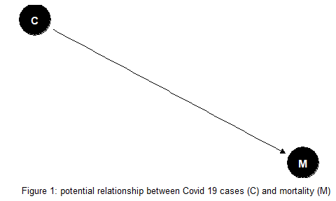
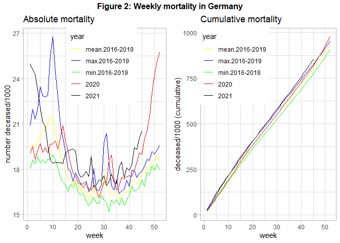
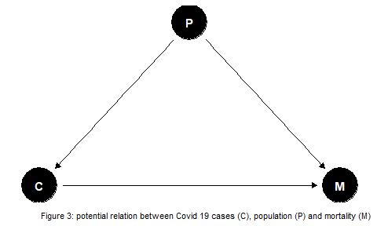
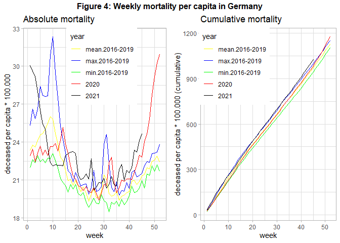
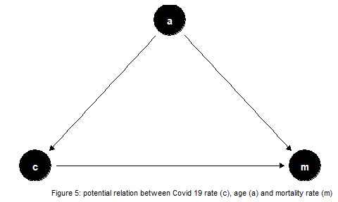

# Germany: Mortality in Times of COVID-19
15 May 2022 (first version 25 Nov 2020)

``` r
#Preliminaries:

knitr::opts_chunk$set( message=FALSE, warning=FALSE) #echo = FALSE,

rm(list=ls())

library(tidyverse)
library(gridExtra)
library(grid)
library(lubridate)
library(dagitty)
library(ggdag)

theme_set(theme_light())
```

## Introduction

Since year 2019/2020 mankind has to deal with the communicable disease
COVID-19. People across many countries and societies as a whole are
affected from both an epidemiological and economic point of view. Data
on mortality was regularly published across media, also to justify
rigorous policy interventions. However, the numbers were rarely well
explained. Hence, we close this gap by using public data from official
statistics in order to visualize the mortality in Germany over time,
also accounting for changes in population size. Following reproducible
research paradigm, code is embedded within the document.

## Absolute Mortality

Figure 1 shows a simple relationship of total COVID-19 (C) and mortality
(M) cases. If such a simple dependency holds then a comparison between
then mortality in year 2020 with the preceding years may reveal the
effect of COVID-19.



Figure 2 shows the mortality of year 2020 (and 2021 up to November), in
contrast to the mean-, minimum-, and maximum- mortality of the 4
preceding years.

``` r
#read data
#source: https://www-genesis.destatis.de/
pop <- read_csv2("filesMortality/PopulationGermany.csv")

#source: https://www.destatis.de/DE/Themen/Gesellschaft-Umwelt/Bevoelkerung/Sterbefaelle-Lebenserwartung/Tabellen/sonderauswertung-sterbefaelle.html?nn=209016
deaths <- read_csv2("filesMortality/sonderauswertung_sterbefaelle_Tage_26Nov2021.csv")

pop_year <- pop %>%
  #gather(`31.12.2015`, `31.12.2016`,`31.12.2017`,`31.12.2018`,`31.12.2019`,
  #       key="end_of_year", value=population) %>%
  mutate(year=as.integer(substr(Datum,5,8))+1) %>% #Population is taken as reference for following year
  #group_by(Jahr) %>%
  rename(population=Anzahl) %>%
  select(year, population)

deaths_tab <- deaths %>%
  #filter(Jahr<2021) %>%
  gather(`01.01.`:`31.12.`,
         key=day_month, value=deaths)  %>%
  mutate(day=dmy(paste0(day_month, Jahr)), deaths=as.integer(str_replace(deaths, " ", ""))) %>%
  rename(year=Jahr) %>%
  select(year, day,deaths) %>%
  drop_na(deaths) 


#plot 1 absolute and 2 relative mortality (per capita)

#calculate number of deaths across time:
pop_death_time <-  deaths_tab %>%
  group_by(year, week=week(day)) %>%
  summarise(deaths=sum(deaths), days_in_week=n_distinct(day)) %>%
  filter(days_in_week==7) %>%
  group_by(year) %>%
  arrange(week) %>%
  mutate(deaths_cum=cumsum(deaths))  %>%
  arrange(year, week) %>% 
  inner_join(pop_year, by="year") %>% ##add population data
  mutate(deaths_rel=deaths/population, deaths_cum_rel=deaths_cum/population)


#subset data with year>=2020:
pop_death_time_2020 <- pop_death_time %>%
  filter(year>=2020) %>%
  select(year, week, deaths, deaths_cum, deaths_rel, deaths_cum_rel) %>%
  mutate(year=as.character(year))

#subset time before 2020: min, mean, max death values (absolute and cumulative), same format as in pop_death_time_2020
pop_death_time_base <- pop_death_time %>%
  filter(year<2020) %>%
  group_by(week) %>%
  summarise(mean_deaths=mean(deaths), min_deaths=min(deaths), max_deaths=max(deaths), mean_deaths_cum=mean(deaths_cum), min_deaths_cum=min(deaths_cum), max_deaths_cum=max(deaths_cum), mean_deaths_rel=mean(deaths_rel), min_deaths_rel=min(deaths_rel), max_deaths_rel=max(deaths_rel),
            mean_deaths_cum_rel=mean(deaths_cum_rel), min_deaths_cum_rel=min(deaths_cum_rel), max_deaths_cum_rel=max(deaths_cum_rel)) %>%
  gather(`min_deaths`, `max_deaths`, `mean_deaths`, `min_deaths_cum`, `max_deaths_cum`, `mean_deaths_cum`,
        `min_deaths_rel`, `max_deaths_rel`, `mean_deaths_rel`, `min_deaths_cum_rel`, `max_deaths_cum_rel`, `mean_deaths_cum_rel`,
       key="compare", value="death")  %>%
  separate(compare, sep="_deaths", into=c("year", "outcome")) %>%
  mutate(outcome=ifelse(outcome=="", "abs", outcome)) %>%
  spread(outcome, death) %>%
  rename(deaths=abs, deaths_cum=`_cum`, deaths_rel=`_rel`, deaths_cum_rel=`_cum_rel`) %>%
  relocate(year)
  
#data set containing information on >=2020,min,max,mean-mortality, both absolute and relative to population size
pop_death_time_comp <- pop_death_time_2020 %>%
                        bind_rows(pop_death_time_base) %>%
                        mutate(year=as_factor(case_when(year %in% c('2020', "2021") ~ year,
                                       year=='max' ~ "max.2016-2019",
                                       year=='min' ~ "min.2016-2019",
                                       year=='mean' ~ "mean.2016-2019")), year=fct_relevel(year, "mean.2016-2019", "max.2016-2019", "min.2016-2019"))


#plot total deaths over time:
col <- c( "2020"="red", "2021"="black", "max.2016-2019"="blue", "mean.2016-2019"="yellow", "min.2016-2019"="green")


#1 plot absolute mortality
p1 <- pop_death_time_comp %>%
  ggplot(aes(x=week, y=deaths/1000, group=year, color=year)) +
  geom_line() +
  scale_color_manual(values=col) +
  labs(title = "Absolute mortality", y="number deceased/1000") +
  theme(legend.position = c(0.55, 0.8))

#plot cumulative absolute mortality: 
p2 <- pop_death_time_comp %>%
  ggplot(aes(x=week, y=deaths_cum/1000, group=year, color=year)) +
  geom_line() +
  scale_color_manual(values=col) +
  labs(title = "Cumulative mortality", y="deceased/1000 (cumulative)") +
  theme(legend.position = c(0.25, 0.8))

#combine 2 plots next to each other
title1=textGrob("Figure 2: Weekly mortality in Germany", gp=gpar(fontface="bold"))
grid.arrange(p1,  p2, ncol=2, top=title1)          
```



When interpreting this figure we have to acknowledge that in 2018 there
was a very high mortality due to a very severe influenza season in the
first quarter. We see for 2020 three peaks of relatively high mortality
in week 15, around week 32, and from week 42 onward. The first and the
last peak was correlated with strong policy interventions (“lockdown”).
We also see that the cumulative mortality in 2020 was relatively high,
at the end of the year even maximum mortality of year 2018 was
surpassed. For year 2021 the mortality remains high, with an increasing
tendency from the middle of the year onward.

<!--Our findings are in line with @zur2020sonderauswertung, who argued that absolute mortality in 2020 will probably not be higher than that of year 2018. -->

## Mortality per capita

However these total number can provide wrong evidence about the
mortality, if the population changes between the years: If the
population number (P) increases we would expect that more people die
(see Figure 3), also in absence of COVID-19.



Hence, we have to account for change in population size. Figure 4 shows
the data from above but uses the population of the beginning of each
year in order to calculate number of deceased per capita.

``` r
#2 Calculate Mortality per capita (population at the beginning of year): 
#plot absolute mortality per capita:
p3 <- pop_death_time_comp %>%
  ggplot(aes(x=week, y=deaths_rel*100000, group=year, color=year)) +
  geom_line() +
  scale_color_manual(values=col) +
  labs(title = "Absolute mortality", y="deceased per capita * 100.000") +
  theme(legend.position = c(0.55, 0.8))


#plot cumulative mortality per capita:
p4 <- pop_death_time_comp %>%
    ggplot(aes(x=week, y=deaths_cum_rel*100000, group=year, color=year)) +
    geom_line() +
    scale_color_manual(values=col) +
    labs(title = "Cumulative mortality", y="deceased per capita * 100.000 (cumulative)") +
    theme(legend.position = c(0.25, 0.8))

#combine 2 plots next to each other
title2=textGrob("Figure 4: Weekly mortality per capita in Germany" , gp=gpar(fontface="bold"))
grid.arrange(p3,  p4, ncol=2, top=title2)
```



We find that changes of the number of citizens did not alter the found
pattern from above. In the end of 2020 overall mortality increased
strongly, probably driven by COVID-19. The same holds true for year
2021, although this data is still preliminary at the time of data
analysis. However, other potential relevant variables are not included
into to the analysis. If the relationship between COVID-19 cases and
mortality is confounded by the important variable age (see Figure 5) we
need to account for changes in the age structure over the years in our
analysis, as suggested in Figure 5:



Ragnitz (2022) emphasizes the role of ageing that needs to be accounted
for when comparing expected mortality with actual mortality – otherwise
‘excess mortality’ would be overestimated. Contemporary literature
discusses the size of COVID-19 associated excess mortality in Germany.
Stang et al. (2020) find an increased mortality for most age groups 60+
during the first wave of COVID-19. De Nicola, Kauermann, and Höhle
(2022) analyse age specific mortality during the year 2020. They
distinguish between weekly and yearly mortality and also compare
different methods. The authors find overall excess mortality was about 1
percent in 2020, mainly driven by fatalities in higher age groups at the
end of the year. Another interesting enterprise is to consider further
potential missing variables that might bias estimates of the COVID-19
impact on mortality. Findings of Wollschläger et al. (2022) indicate
excess mortality as well, after adjusting for air temperature, seasonal
influenza-activity and socioeconomic deprivation as additional risk
factors.

So far, [international
comparisons](https://ourworldindata.org/covid-deaths) suggest that some
countries were more severely hit by the COVID-19 pandemic than others.
The future may tell where this was due to better policies, and which
other factors played an important role.

Take care and stay healthy! :)

## References

Auguie, Baptiste. 2017. *gridExtra: Miscellaneous Functions for "Grid"
Graphics*. <https://CRAN.R-project.org/package=gridExtra>.

Barrett, Malcolm. 2021. *Ggdag: Analyze and Create Elegant Directed
Acyclic Graphs*. <https://CRAN.R-project.org/package=ggdag>.

De Nicola, Giacomo, Göran Kauermann, and Michael Höhle. 2022. “On
Assessing Excess Mortality in Germany During the COVID-19 Pandemic.”
*AStA Wirtschafts-Und Sozialstatistisches Archiv*, 1–16.

Grolemund, Garrett, and Hadley Wickham. 2011. “Dates and Times Made Easy
with <span class="nocase">lubridate</span>.” *Journal of Statistical
Software* 40 (3): 1–25. <https://www.jstatsoft.org/v40/i03/>.

Ragnitz, Joachim. 2022. “Übersterblichkeit während Der Corona-Pandemie.”
*Ifo Dresden Berichtet* 29 (01): 29–35.

Stang, Andreas, Fabian Standl, Bernd Kowall, Bastian Brune, Juliane
Böttcher, Marcus Brinkmann, Ulf Dittmer, and Karl-Heinz Jöckel. 2020.
“Excess Mortality Due to COVID-19 in Germany.” *Journal of Infection* 81
(5): 797–801.

Wollschläger, Daniel, Irene Schmidtmann, Sebastian Fückel, Maria
Blettner, and Emilio Gianicolo. 2022. “Erklärbarkeit Der
Altersadjustierten Übersterblichkeit Mit Den COVID-19-Attribuierten
Sterbefällen von Januar 2020 Bis Juli 2021.”
*Bundesgesundheitsblatt-Gesundheitsforschung-Gesundheitsschutz* 65 (3):
378–87.
